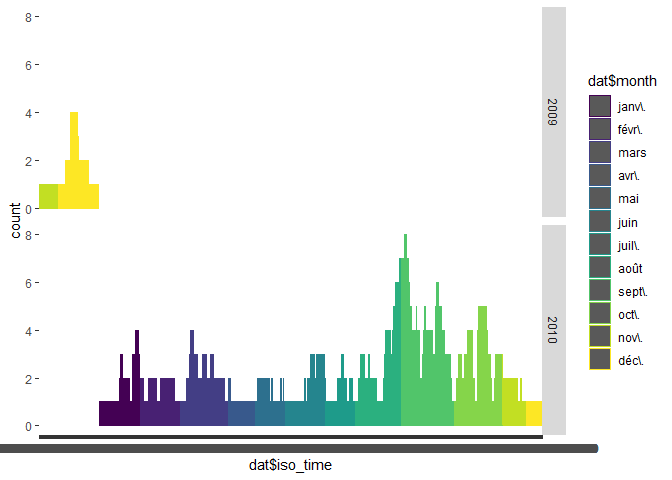
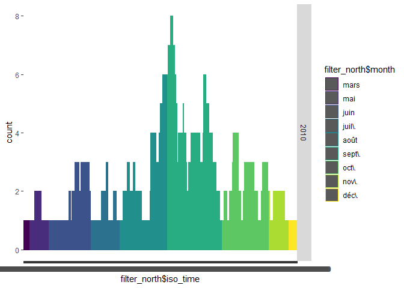
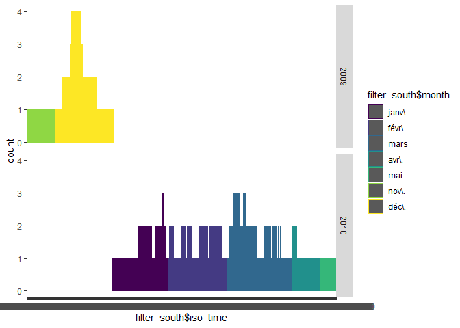
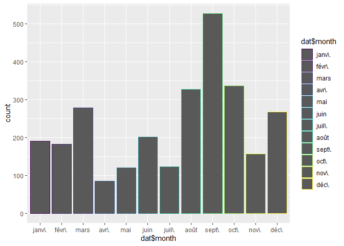

workout1-maya-bachir
================

Report
======

``` r
library(dplyr)    # data wrangling
```

    ## Warning: package 'dplyr' was built under R version 3.5.3

    ## 
    ## Attaching package: 'dplyr'

    ## The following objects are masked from 'package:stats':
    ## 
    ##     filter, lag

    ## The following objects are masked from 'package:base':
    ## 
    ##     intersect, setdiff, setequal, union

``` r
library(ggplot2)  # graphics
```

    ## Warning: package 'ggplot2' was built under R version 3.5.3

``` r
library(tidyverse) #contains readr
```

    ## Warning: package 'tidyverse' was built under R version 3.5.3

    ## -- Attaching packages ------------------------------------------------------------------------------ tidyverse 1.2.1 --

    ## v tibble  2.1.3     v purrr   0.3.2
    ## v tidyr   1.0.0     v stringr 1.4.0
    ## v readr   1.3.1     v forcats 0.4.0

    ## Warning: package 'tibble' was built under R version 3.5.3

    ## Warning: package 'tidyr' was built under R version 3.5.3

    ## Warning: package 'readr' was built under R version 3.5.3

    ## Warning: package 'purrr' was built under R version 3.5.3

    ## Warning: package 'stringr' was built under R version 3.5.3

    ## Warning: package 'forcats' was built under R version 3.5.3

    ## -- Conflicts --------------------------------------------------------------------------------- tidyverse_conflicts() --
    ## x dplyr::filter() masks stats::filter()
    ## x dplyr::lag()    masks stats::lag()

``` r
library(maps) #maps
```

    ## Warning: package 'maps' was built under R version 3.5.3

    ## 
    ## Attaching package: 'maps'

    ## The following object is masked from 'package:purrr':
    ## 
    ##     map

``` r
library(lubridate) #handling the date
```

    ## Warning: package 'lubridate' was built under R version 3.5.3

    ## 
    ## Attaching package: 'lubridate'

    ## The following object is masked from 'package:base':
    ## 
    ##     date

``` r
dat <- read.csv('C:/Users/Maya/Documents/Berkeley/Computing data/Workout1/data/ibtracs-2010-2015.csv', header = FALSE, sep = ";", skip = 2, colClasses = c('character','integer','character','factor','character','character','character','character','real','real','real', 'real'), na.string = c("-999.","-1.0", "0.0"), col.names = c('serial_num', 'season', 'num', 'bassin', 'sub_bassin', 'name', 'iso_time', 'nature', 'latitude', 'longitude', 'wind', 'press'))

dat$month = month(dat$iso_time, label=TRUE)
dat$month_num = month(dat$iso_time)
dat$year = year(dat$iso_time)
```

Let us first take a look at the location of the storms on a map of the Earth:

``` r
knitr::include_graphics('C:/Users/Maya/Documents/Berkeley/Computing data/Workout1/images/map-all-storms.png')
```


We will commence our exploration by taking a look at the number of time each storm occured per year. Total number of unique storms:

``` r
count(distinct(dat, Name, .keep_all = FALSE))
```

    ## Warning: Trying to compute distinct() for variables not found in the data:
    ## - `Name`
    ## This is an error, but only a warning is raised for compatibility reasons.
    ## The operation will return the input unchanged.

    ## # A tibble: 1 x 1
    ##       n
    ##   <int>
    ## 1  2787

``` r
count(dat, dat$serial_num, dat$year)
```

    ## # A tibble: 88 x 3
    ##    `dat$serial_num` `dat$year`     n
    ##    <chr>                 <dbl> <int>
    ##  1 2009317S10073          2009    28
    ##  2 2009325S12066          2009    25
    ##  3 2009337S07096          2009    58
    ##  4 2009342S09140          2009    66
    ##  5 2009346S07086          2009    78
    ##  6 2009346S10172          2009    20
    ##  7 2010002S09096          2010    55
    ##  8 2010018N07113          2010    10
    ##  9 2010019S11123          2010    28
    ## 10 2010020S14147          2010    10
    ## # ... with 78 more rows

We can draw those occurences, facetted by year, with the month colored:

``` r
ggplot(dat, aes(dat$iso_time, color = dat$month)) + geom_bar() + facet_grid(dat$year)
```



Let's take a look per hemisphere this time. In the north hemisphere:

``` r
filter_north <- filter(dat, dat$latitude >= 0)
count(filter_north, filter_north$serial_num, filter_north$year)
```

    ## # A tibble: 55 x 3
    ##    `filter_north$serial_num` `filter_north$year`     n
    ##    <chr>                                   <dbl> <int>
    ##  1 2010078N03153                            2010    17
    ##  2 2010136N09057                            2010    25
    ##  3 2010137N10090                            2010    30
    ##  4 2010149N13266                            2010     9
    ##  5 2010151N14065                            2010    53
    ##  6 2010166N15255                            2010    32
    ##  7 2010167N15265                            2010     4
    ##  8 2010169N13266                            2010    50
    ##  9 2010172N08272                            2010    39
    ## 10 2010176N16278                            2010    32
    ## # ... with 45 more rows

``` r
ggplot(filter_north, aes(filter_north$iso_time, color = filter_north$month)) + geom_bar() + facet_grid(filter_north$year)
```

 Total number of storms:

``` r
count(filter_north)
```

    ## # A tibble: 1 x 1
    ##       n
    ##   <int>
    ## 1  1555

In the south hemisphere :

``` r
filter_south <- filter(dat, dat$latitude <= 0)
count(filter_south, filter_south$serial_num, filter_south$year)
```

    ## # A tibble: 26 x 3
    ##    `filter_south$serial_num` `filter_south$year`     n
    ##    <chr>                                   <dbl> <int>
    ##  1 2009317S10073                            2009    28
    ##  2 2009325S12066                            2009    25
    ##  3 2009337S07096                            2009    50
    ##  4 2009342S09140                            2009    64
    ##  5 2009346S07086                            2009    76
    ##  6 2009346S10172                            2009    17
    ##  7 2010002S09096                            2010    44
    ##  8 2010019S11123                            2010    28
    ##  9 2010020S14147                            2010    10
    ## 10 2010022S12160                            2010    36
    ## # ... with 16 more rows

``` r
ggplot(filter_south, aes(filter_south$iso_time, color = filter_south$month)) + geom_bar() + facet_grid(filter_south$year)
```

 Total number of storms:

``` r
count(filter_south)
```

    ## # A tibble: 1 x 1
    ##       n
    ##   <int>
    ## 1   869

It seems that there are more storms in the north hemisphere!

Let's see if there is a time of the year more likely to have storms:

``` r
filter_january <- filter(dat, dat$month_num == 1)
filter_february <- filter(dat, dat$month_num == 2)
filter_march <- filter(dat, dat$month_num == 3)
filter_april <- filter(dat, dat$month_num == 4)
filter_may <- filter(dat, dat$month_num == 5)
filter_june <- filter(dat, dat$month_num == 6)
filter_july <- filter(dat, dat$month_num == 7)
filter_august <- filter(dat, dat$month_num == 8)
filter_september <- filter(dat, dat$month_num == 9)
filter_october <- filter(dat, dat$month_num == 10)
filter_november <- filter(dat, dat$month_num == 11)
filter_december <- filter(dat, dat$month_num == 12)

all_month <- c(count(filter_january), count(filter_february), count(filter_march), count(filter_april), count(filter_may), count(filter_june), count(filter_july), count(filter_august), count(filter_september), count(filter_october), count(filter_november), count(filter_december))
which.max(unlist(all_month))
```

    ## n 
    ## 9

It seems that the ninth month, September, is the one where there are the most storms. Let's observe those results on a graph:

``` r
ggplot(dat, aes(dat$month, color = dat$month)) + geom_bar()
```



Now, let's examine the different bassin. In the EP Bassin:

``` r
dat_EP_bassin <- filter(dat, dat$bassin == ' EP')
count(dat_EP_bassin, dat_EP_bassin$serial_num, dat_EP_bassin$year)
```

    ## # A tibble: 15 x 3
    ##    `dat_EP_bassin$serial_num` `dat_EP_bassin$year`     n
    ##    <chr>                                     <dbl> <int>
    ##  1 2010149N13266                              2010     9
    ##  2 2010166N15255                              2010    32
    ##  3 2010167N15265                              2010     4
    ##  4 2010169N13266                              2010    50
    ##  5 2010172N08272                              2010    39
    ##  6 2010195N14257                              2010    18
    ##  7 2010217N15265                              2010    26
    ##  8 2010232N18253                              2010    12
    ##  9 2010234N14267                              2010    30
    ## 10 2010240N15142                              2010     1
    ## 11 2010246N19251                              2010    10
    ## 12 2010247N15266                              2010     7
    ## 13 2010263N15149                              2010     1
    ## 14 2010264N20252                              2010    12
    ## 15 2010350N30175                              2010    19

Total number of storms:

``` r
count(dat_EP_bassin)
```

    ## # A tibble: 1 x 1
    ##       n
    ##   <int>
    ## 1   270

Let's look at them in a graph now, per year and per month:

``` r
knitr::include_graphics('C:/Users/Maya/Documents/Berkeley/Computing data/Workout1/images/map-ep-storms-by-year.png')
```


``` r
knitr::include_graphics('C:/Users/Maya/Documents/Berkeley/Computing data/Workout1/images/map-ep-storms-by-month.png')
```


In the NA Bassin:

``` r
dat_NA_bassin <- filter(dat, dat$bassin == ' NA')
count(dat_NA_bassin, dat_NA_bassin$serial_num, dat_NA_bassin$year)
```

    ## # A tibble: 21 x 3
    ##    `dat_NA_bassin$serial_num` `dat_NA_bassin$year`     n
    ##    <chr>                                     <dbl> <int>
    ##  1 2010176N16278                              2010    32
    ##  2 2010188N22269                              2010    13
    ##  3 2010203N22286                              2010    18
    ##  4 2010215N13319                              2010    25
    ##  5 2010222N26277                              2010    32
    ##  6 2010234N11329                              2010    51
    ##  7 2010236N12341                              2010    55
    ##  8 2010242N14318                              2010    24
    ##  9 2010244N12328                              2010    30
    ## 10 2010247N15266                              2010    21
    ## # ... with 11 more rows

Total number of storms:

``` r
count(dat_NA_bassin)
```

    ## # A tibble: 1 x 1
    ##       n
    ##   <int>
    ## 1   661

Let's look at them in a graph now, per year and per month:

``` r
knitr::include_graphics('C:/Users/Maya/Documents/Berkeley/Computing data/Workout1/images/map-na-storms-by-year.png')
```


``` r
knitr::include_graphics('C:/Users/Maya/Documents/Berkeley/Computing data/Workout1/images/map-na-storms-by-month.png')
```


